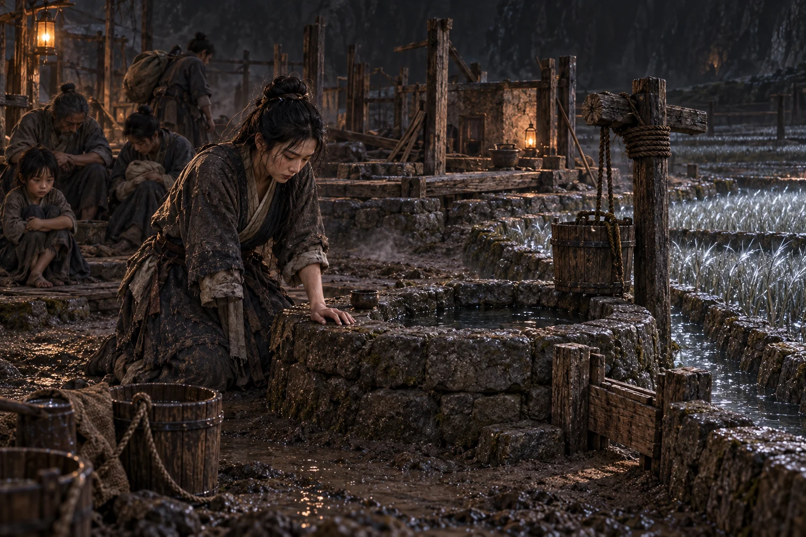

# 第九十七章：只帶三十四戶

換水孔開啟前，三十四戶一起停止喝水。

不是祭獻。淡井每少一名飲水者，鹽主便少一條抽取口渴的供力線。三十四份撤回印同時落下，界壁孔第一次沒有從任何人身上索取乾渴。

半息開始。

換水孔外側先透進一縷濕氣。這條原本供鹽主交換水氣的通道已經開啟，井欄、屋基與主界相連的細線，也在濕契上逐一顯形。秦無漏沿先前解析過的線切開，只留下三十四戶共同標記的範圍。

秦無漏左手按住空胎入口，右臂劍痕卻被鹽沼界壁的白光拉開。殘核把三項條件疊在一起：假契背面的換水孔、每戶血中井水、屋基共同使用痕跡。

【可截範圍：淡井及三十四戶生活座標。】

「開。」

黑暗沿井欄展開。

第一批進門的是孩子與傷者，接著是屋基。房屋本身沒有全帶，只截取灶、床腳、門檻與居民仍在使用的部分。有人抱著祖傳鹽缸跑來，缸上後來加刻的鹽額印卻仍連著主界，牽得整條門縫向外彎曲。那條未解開的供力線不在先前標記之內。

「不要了！」那人鬆手，空著雙臂跨過去。

鹽主啟動界核，整片鹽沼向淡井壓來。近六千名剩餘居民的口渴被再次抽取，化作白牆封門。

秦無漏沒有反抽。他先穩住一百零二人的標記，鹽霧裡卻又亮起幾道求救照影。

一名男人朝光伸手：「帶我走！」

婦人認得他，立刻回身去拉，手卻穿過照影。男人還在遠處的鹽渠旁，面前只有映在鹽霧上的門光，並未到達換水孔。

「他說要走！」她喊。

秦無漏試著向那邊延出一線標記。光才越過井欄，鹽主的白牆便壓下來，尚未入門的兩戶屋基同時向外滑。那人沒有與他完成法則接觸，鹽渠的牽引線也未解析，臨時放大入口只會讓已固定的座標先散。

半息已過一半。秦無漏收回探出的光，把滑動的屋基拉回來。

「看見你了。先退回渠邊！」

男人的影子被白牆遮住。秦無漏記住他指向的岔渠，也記住那聲求救。他願意離開；沒能把他接進來，是這扇門與自己的能力到不了那裡。

淡井最後進入。

井底連著鹽沼水脈，不能全截。秦無漏只套住一口水深、井欄和十九年共同清淤留下的殘序。切斷時，婦人與三十多名居民同時吐血——井早已成為身體的一部分。

換水孔閉合。

萬界城三槐台外多出一圈潮濕屋基。一百零二人橫七豎八倒在灰土上，淡井立在中央，水面只比井底高三尺。

沈季年逐名核對。

一百零二人，全到。

沒有影子掉在鹽沼，沒有名字失去座標，沒有三成山河散入虛無。屋基與井也完整對應原標記。

補天舟正從界外看著。

查驗短尺上的預估損耗原為三十一人、井水三成。實際一欄卻全部是零。

秦無漏知道遮不住了。

鹽沼另一端傳來哭喊。淡井消失後，剩餘近六千居民的井全部開始鹽化。鹽主失去三十四戶供力，也失去唯一能換入外濕的孔。留下的人不是秦無漏直接傷害，卻確實因他的選擇承擔後果。

婦人聽見遠端照影，跪在新井邊。

「我們是不是偷了他們的水？」

「井有你們十九年的份。」沈季年說。

「那他們就不渴了嗎？」

沒有人能用權利回答後果。

斷帳議緊急送出水援。雨簷界願提供一場小雨，條件是鹽沼居民自行建立配水席，不再由鹽主抽取口渴。鹽主拒絕雨進界，怕雨簷趁機取得土地標記。

剩餘居民開始攻打鹽田水庫。

三十四戶要求把新井立刻送回，被耕席否決：再次穿越已無換水孔，強開只會讓人與井一同散失。秦無漏也不能用無損能力抹掉已作選擇的方向。

淡井暫時封存，只給一百零二名新客居者最低飲水。青角族拒絕井水接入母根，因為鹽沼法則可能污染青角林。最後只能把井安在劍穗田外渠，與所有既有水脈隔開。

空間裡第一次多出一口真正的淡水井，井上方卻沒有歡呼。

<figure class="chapter-illustration">
  
  <figcaption>第97章 淡井到了，井邊卻沒有歡呼</figcaption>
</figure>

補天光柱穿透界門，準確照在井欄。

查驗吏展開剛才的全程記錄。

「預估散逸三成。」

「實際散逸：零。」

白玉面具轉向秦無漏。

「依中樞戰略條款，要求重演。」

「交出無損截界方法。」
