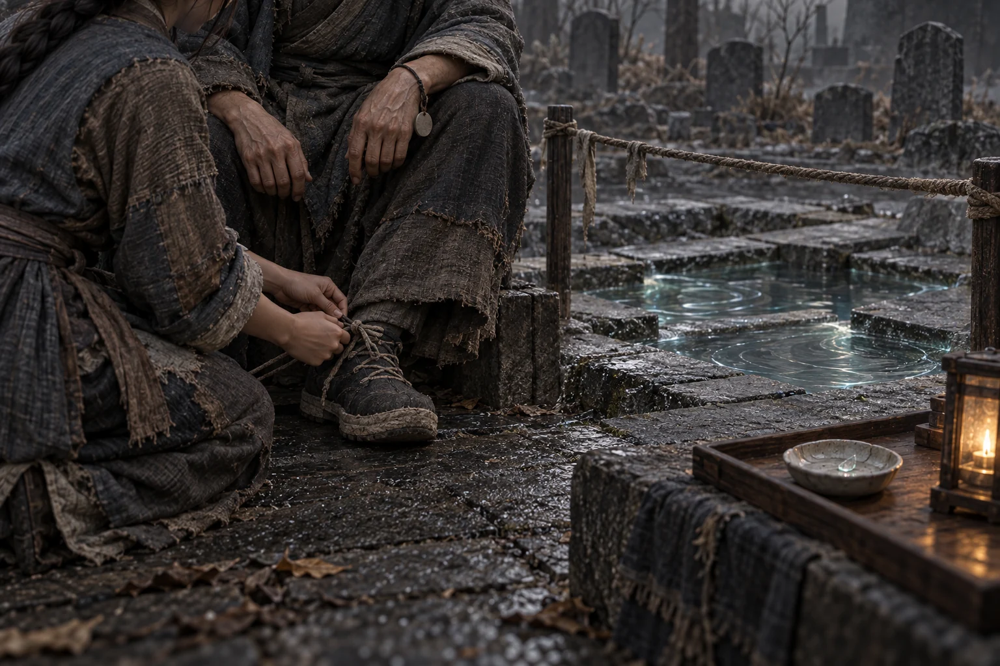

# 第一百一十章：痛泉

藥谷落穩時，第一個來敲沈季年桌子的，是個提空碗的孩子。

他的母親跟在後面，手裡拿著原鎮的糧牌，不知道該把它交給誰。糧倉就在不遠處，袋口卻還封著運送時的繩結，守倉人說要等名冊過來，錄冊的人又叫她先去問客居登記。

秦無漏從渠邊抬起頭，讓兩邊的人到同一張桌前。

「先對名字，再領今天的份。」沈季年將客居冊壓在左手下，把配給冊翻到右邊，「入籍可以另談，這頓飯不能等。」

六鎮一門一門送來實到名冊，與轉移前的六千七百八十四人相符。藥谷仍保有自己的分鎮席位，居民取得客居資格，尚未因此成為正式居民；可他們已經站在城裡，會吃飯、用水，也有傷者需要床位。

劍無咎在此時被方折押過內門。

他解劍後的雙手空著，入城仍要驗印。錄冊人正要合頁，沈季年伸手攔下，將他單列為候審在城者，配給再添一口。監押需要有人守，候審者也需要飯，沒有哪一項會因他曾是宗主便憑空解決。

最後合出的實際供養人口是四萬九千二百一十二人。

秦無漏看著比昨日厚了一截的冊子。正式居民四萬二千一百六十四，客居與候審在城者合計七千零四十八；餘下兩個失聯鎮仍留在青藥界，放在外界聯絡頁，沒有混進眼前這一列數字。

糧袋逐一開封。六鎮帶來的二萬七千一百三十六人日普通存糧，依各鎮已同意的方案接入最低配給。秦無漏看見原鎮領糧人與萬界城倉吏站在秤的兩側，一方念袋號，一方記重量，各留一份。剛才帶著糧逃命的人，此刻還能查到自己的糧去哪裡。

青銀穀則被阮青禾移到另一張桌上，掛了試藥封條。就算長得像穀，也不能拿來填普通糧欄。

扣去遷移與守門期間的消耗，現有可食存糧按新口數，只夠約七日。

那孩子捧到粥，先吹了一口，再把碗遞給母親。秦無漏看著他們走到牆根坐下，才轉身去看被燒的田。

一畝藥田已成黑地，周邊的田埂與主渠還在。田主蹲在焦土裡，從竹簍下面翻出兩株沒燒透的藥根。劍祭的受害者可以去審理席說話，他這塊剛燒掉的田也得有人處理，卻不能在宗主案中順手寫成另一筆已抵消的功過。

秦無漏將守城照影中的落矛位置指給他看，約定由耕席與藥谷共同核實損失。眼下先從可用種根裡留一份補種，糧倉不因此增加預估收成。那人問何時能拿到，秦無漏沒有答一個好聽的日子，叫管種根的人當面點出能分的數量。

土裡仍有細火，田主放下藥根，跟著去點。

半谷被固定在劍穗田上游。支撐它的土石原本就在谷中，萬界城提供的是接住它們的局部錨點。坡下的淡井水流進舊渠，再與分割後的藥泉相遇，水面漸漸浮出青銀兩色的紋路。

新谷的水工伏在渠沿試水，臉上沒有喜色。兩側泉效下降四成的結果已得到回測，原界井水轉苦、局部退水的情況卻還沒有修好。信路只斷續送來尺影，四個留守鎮能報水位，另兩鎮依然沒有答覆。

有人建議把原界那頭先斷乾淨，免得追兵循水找到城。水工將尺橫在渠上，說斷了以後，連那邊缺多少都不知道。

秦無漏讓紙鳶核對信路，只保留不再牽動土地的窄幅照影。它仍有暴露位置的風險，每次接通都須移換外層轉接點。萬界城承擔這次分泉留下的修補責任，也得付出繼續聽見對方的時間與力氣。

到了墓地，先前繃緊的布繩已換過一遍。

守門時湧入的痛意讓隔離池漲到石沿。守墓人不敢把新水導向有名碑，便將幾片空白石板拉開，讓不同來路的泉聲暫時各占一角。秦無漏站在繩外，看見青銀水紋在灰光中慢慢閉合，這次沒有隨停止出劍立刻散去。

痛泉的雛形留下了。

阮青禾把離體神魂裂片放在淺皿中，只取封存過的微量泉樣接觸。裂片邊沿重新貼合的地方，她指給秦無漏看；泉樣另一側，對應的痛意仍浮在石片上，並沒有因水清了而消失。

杜衡由女兒陪著過來，腳上穿了厚底鞋，腕邊的痛牌轉到他自己看得見的位置。他沒有跨過隔離繩，先問淺皿裡的效果能不能用在他身上。

阮青禾將第一次試驗的傷圖攤開。「修復的三成還在。剩下的能否再修、會再丟多少痛覺，現在不知道。」

杜衡低頭看牌。「今早我還以為能自己找扣子。現在找一樣東西，要先叫人。」

女兒沒有接話，只替他把鞋帶繫緊。

<figure class="chapter-illustration">
  
  <figcaption>第110章 女兒繫緊鞋帶，泉邊仍留一道繩</figcaption>
</figure>

「我還是想治。」他說。

「你的意願我會記。今天不追加。」阮青禾指向池沿，「我們連上一次送出去的東西，都還沒全安置好。」

守墓老婦從繩邊走來，放下一枚封泉印。她值守時有一瞬把別人的痛當成自己的，換人後才辨回來。她願意說清剛才聽到了什麼，卻不願再把那段缺失的私人記憶多空一點出來。

「今天到這裡。」她說。

這次沒有誰讓她再撐一會兒。

先前留下的臨時封泉權被放到同一張桌上，寫成每次開泉都要核對的三道印。患者決定自己是否接受治療，並能中止自己的那一次；患者席不能替別的病人按手印。醫坊確認劑量、觀察與停止條件，未達最低安全就不開試驗。墓地確認有誰自願保存、還能保存多少，無人承接便不得把痛意送入。

取水冊上新增的不是只有藥量，還有患者、承接者與隔離位置。

沈季年拿來第一張取水記錄，想將今日離體覆查與之後試驗排在一起。老婦把自己的印扣住，阮青禾也將追加試驗欄劃去，只留下已完成的那一皿。杜衡看著空下來的位置，伸手把原先預留給他的藥碗推回醫箱。

秦無漏原本想問能否先多留一份戰時備用，話到了嘴邊，停了。他見過那一畝燒毀的藥田，也親手將新谷接進來，沒有因此得到把泉邊這些人排在最後的權力。

外門送來航向已穩的消息。先前火舟與補天鎖鏈的相撞給了布防時間，劍無咎守出的七息則讓藥谷完全收入；紙鳶利用獵舟掠過後尚未收緊的斜角，終於把萬界城帶出谷外的合圍。

追光留在後方，沒有消失，只暫時被轉接的碎界遮住。

秦無漏叫人將痛泉繩外清空，準備封住最後一處樣水。就在老婦收起布繩時，一片青銀紋路忽然朝相反方向顫了一下。

泉裡響起金屬相碰的聲音。

不是方才的火矛。那聲音很近，很細，像有人把額頭抵在狹小的鐵條間，反覆磨著同一處。隨後是一陣從骨裡拔起的痛，秦無漏尚未碰水，眼前已閃過一截斷角。

老婦立刻將石片移向空白處，沒有讓它靠上杜衡的那一層。

「新來的。」她說。

碎影斷續浮出：鐵籠、帶血的剪具，還有一隻縮在低矮頂板下的幼獸。它盯著籠外的亮處，嘴唇動了幾次，聲音終於穿過水面。

「天空……是什麼？」

秦無漏蹲下。那幼小的影子往後縮，角根的傷讓它發抖，身後有人伸手擋住照影，急促地說，別讓看籠的人聽見。

一小段座標隨那隻手留在石片上。紙鳶將它與現有航圖比對，指尖停在萬族牧場的標記旁。

秦無漏沒有開門。他先讓泉邊的人保住這段訊號，再去請棘蘿辨認求援者。藥谷的井仍苦著，新的糧冊也只剩七日；眼前那隻手卻正冒著被發現的風險，把籠子的位置一寸寸推過來。

下一個獵物不是一座待拆界，而是一群被當作資源繁殖的生命。
