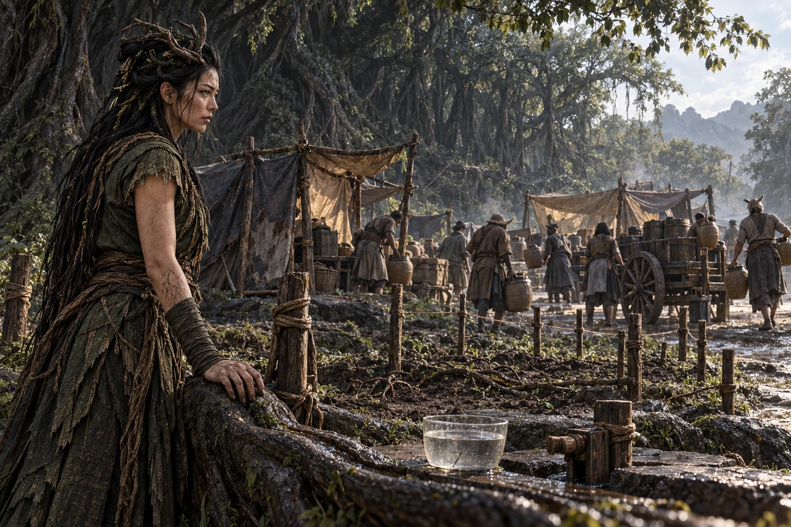

# 第一百一十九章：妖林邊界

天亮時，母根林前已有一罐水被踩進泥裡。

抱罐的女人跪在地上，用兩手攏水。水沿指縫流走，沾著她頸側薄鱗上脫落的碎皮。橫在林口的枝條就在她頭頂，後面有露，卻沒有一個護林人敢讓她過。

秦無漏走到近前，先叫搬水的人把剩下半罐送到她身邊。

「別撿地上的。」

女人沒停手。

阮青禾蹲下，將她的手從泥裡托起。她頸側的鱗縫已經乾裂，呼吸時發出細微的擦聲；身後同族的人都用濕布捂著頸子，有人的布早乾了，仍不敢拿開。

爭執從昨晚拖到現在。

城內七萬九千二百一十二口人的取水隊伍排過藥谷坡下。昨日新來的人有屋基，有些還帶著完整的井罐，卻沒有足以支撐所有人的持續水源。搬一趟水車，隊伍往前挪一點；來一副新擔架，前面又要多留幾碗。

林裡的水看得見。

那是最難解釋的一件事。

一名護林老人將袖口捲起，露出小臂上幾塊像磚皮的舊痂。他說這是早年母根與城地互相侵蝕時留下的，半夜睡著，皮肉底下會有牆角往外頂。

汀衣看見那些痂，攏水的動作慢了一點。

老人也看見她裂開的鱗縫，原本頂在橫枝後的肩膀往旁挪了挪，讓送水的人走得近些。他沒有撤掉枝條，她也沒有再試著鑽過去。兩種傷隔著一道根，誰都沒有因為先到了這座城，就變得輕一點。

秦無漏叫水工把現存罐數帶來。根裡有露，與眼前能分出多少水，是兩件要各自查清的事。

棘蘿站在橫枝後，手背上還黏著刮根的黑皮。她沒有讓護林人把長刃對準人群，也沒有抬起橫枝。

「核心林不能直接接。」

她指向幾處原有根槽。昨日另授出去護板的根段已到止用邊界，前日受傷那段仍在養；此處若同時引入多族生活法則，先相斥的是母根，接著是住在林裡的人。

人群中有人說，青角族也是從籠裡出來的。

棘蘿看了他一眼。

「所以你們要我替這裡的人按印？」

那人沒答，仍盯著枝後一滴將落未落的露。

秦無漏蹲到根槽旁，左手不能用力，只用指節輕敲外沿。裡面那一層青色黏膜比前幾日薄，細根貼著槽壁，沒有繼續往外長。

他原本畫過一張將新棚區直接接進林網的圖。

圖在袖裡，折得很平。

「你要我接嗎？」棘蘿問。

秦無漏取出那張圖，將通往核心林的線劃掉，交給沈季年。

「撤這一版。」

人群裡頓時吵起來。

「那我們就在外面乾死？」

「外面另找能用的根。」他站起來，「今天能接多大，就把邊界釘在地上。沒接上的棚，水車繼續送。」

「水車不夠。」沈季年道。

秦無漏讓他把車、罐與值役人手拿來。原本排去整理新倉的兩隊人，有一隊能挪出來；另一隊正拆驗隔離糧，不能停。他抽掉前者今日整倉的安排，再把那張暫緩的倉單放在桌面，讓管倉的人看。

「延誤記我這裡。罐先上車。」

倉裡因此會亂上幾日，不會因他說一句話便同時整齊起來。但林前很快多了一架空車，車夫把原用來墊糧袋的木條卸下，改墊水罐。

抱罐女人終於坐回地上，將濕布重新敷上頸側。

她說自己叫汀衣。

這回沒有先報籠號。

棘蘿讓護林人移開旁側的一段矮枝，帶秦無漏去看林外的廢根地。那裡早年根脈與城市互相侵蝕，留下幾道長不進核心的支槽，夾在舊石基和新棚間。

根還活著，原本就只供外緣。

「這裡能試。」她說，「只試這裡。」

他們沿槽放下木樁。秦無漏站在林外這一側，棘蘿走在林內那一側，走到根皮變薄的位置，她停了。

木樁就釘在那裡。

幾個遷入族群各自叫來願意說話的人。有人要濕地，有人怕長根穿過床底，有人只求夜裡不再被趕走。棘蘿將核心林的界線擺明，秦無漏讓他們把自己的住地需求也畫到紙上，沒讓一個嗓門最大的人替所有族群落印。

最後留下的是兩層地方。

核心林仍由青角族自己管。外緣劃作共同森林，各族先按客居住地分片，再共同使用水路和通行處；動到哪一族的生活區，那一族可以拒絕，牽動根與水的事還須根席同意。

有一個人想把「入住後不得撤回」添在末尾，被沈季年用筆背擋住。

「昨天才離開的那張契，你今天又想寫？」

那人把手縮了回去。

議定的第一小區只有幾頂棚。棘蘿指出可供的根段，汀衣與同族先決定哪些人願意試住；不願意的人仍在普通棚地，照領限量水，沒有被劃掉配給。

根槽旁另放了一隻清楚見底的量罐。到刻線，便停擴；誰覺得身體或住地不對，可以先斷自己那一支，不必等整片林都表決完。

木樁之間的細根緩緩舒展。

沒有大樹一夜拔地而起。外緣只是多了幾條能掛濕布的枝，幾頂棚底的泥不再那麼快乾裂。汀衣用指腹摸過根上結出的薄露，沒有把它立即送進嘴裡。

「以前我們住的地方，牆會吐霧。」她說。

她從衣襟裡取出一小片自然脫落的鱗膜。鱗膜用布包著，是遷移時帶出的舊物；她平日靠它和濕布辨哪裡乾得太快，放在掌中，邊緣會慢慢蜷起。

阮青禾讓她先說明，願意拿這一片試，還是只願讓人看。

汀衣看了一眼旁邊等水的族人，最後把那片膜放到空皿裡。

「試這片。人先不試。」

棘蘿讓一小段已授出的外緣根靠近皿沿。水工從量罐中取了少量水潤根，薄霧剛浮起，鱗膜邊緣便抬了抬，貼住根上混著汀衣生活標記的那一小處。

霧沒有向四周散開。

它沿膜上的細紋聚到下面，滾出一滴水，落回皿中。

秦無漏俯下身。

同一段根另一側，沒有接觸鱗膜的水霧仍在散去。鱗膜貼過的地方卻像多了一圈矮牆，把原本要散掉的濕氣攏了一點回來。

界圖在他神魂裡亮起細小的交線，只連著已有的水、根和那片膜，沒有新的土地，也沒有憑空多出的泉眼。

殘核給出的答覆很短。

「局部反應。維持耗用未明。」

秦無漏拿起另一隻乾皿，想請她們重做一次，還未開口，棘蘿先抬手。

那一點根皮正在發白。

汀衣將鱗膜移開，薄霧立刻散了。白處沒有當場退去，阮青禾把皿封起，水工則將試用的那筆水從量罐刻度中扣下。

秦無漏放回乾皿。

「今天到這裡。」

剛才那一滴水是真的，根皮變白也是真的。他讓沈季年把兩件事寫在同一行，沒給這種反應取一個能讓人以為從此不缺水的名字。

林外一位搬水人看見小區開始出露，已把後面幾頂棚的水罐挪過來，想順手多接幾支。量罐很快降到刻線，棘蘿當即合上那一段分水口。

後面的人喊了一聲，叫她再多撐片刻。

秦無漏走過去，將多接的空管從槽沿拿下，放回那人腳邊。

「線到了。」

「後面還有人。」

「所以車還在走。」他指向坡下，「你要幫，去抬罐。」

那人臉紅了一陣，最後抱起一隻空罐走了。根槽沒再往外多出一條線，普通棚地也沒有因此被忘在黑處。

另一頭的水車恰好回來，卸下幾只罐。汀衣從新得的那份水裡舀出一小碗，放到刮根工旁邊，說洗手上的黑皮要用水。

那名青角族看著她，過了片刻，才把手伸過去。

秦無漏隔著木樁看見這一幕，沒叫人替他們立一塊碑。

共同森林還只有這麼一小片。

<figure class="chapter-illustration">
  
  <figcaption>第119章 木樁之內試住，木樁之外送水</figcaption>
</figure>

紙鳶帶著外面的回報走進林邊時，日光才移到新棚上方。前一日留下的兩處側口仍在當地人手裡，一處已把最後一批願走的人聚到接架旁，另一處說高臺正換新鎖，願意守門的時間不會太久。

秦無漏接過回報，先看水單。

這片林沒有能力把後來的人全接住。

他把其餘空地、水罐、隨遷屋基與可用人手重新排開，去掉那塊不能再擴的根地。沒有林蔭的地方便搭普通棚，水接不上就帶罐，能少帶一段無人使用的地，就多留一處擔架轉身的位置。

「還接？」沈季年問。

秦無漏看著兩道即將被封的門。

「接。把接不住的項目劃掉，別把人先劃掉。」

他將新的接應表交給方折，自己朝外門走去。

身後，那一小片林在木樁之內落下幾滴露。木樁外的水車碾過泥地，車輪陷了一下，被幾雙不同的手一起推了上來。
